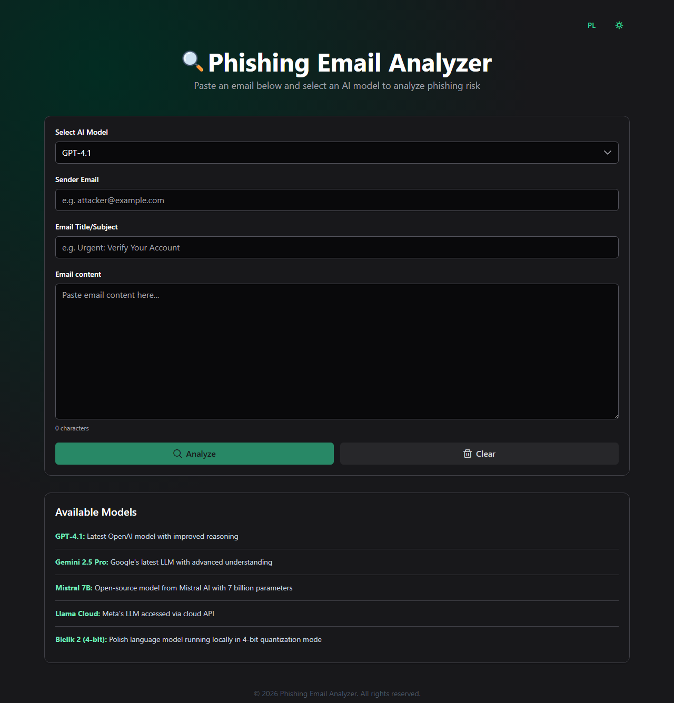
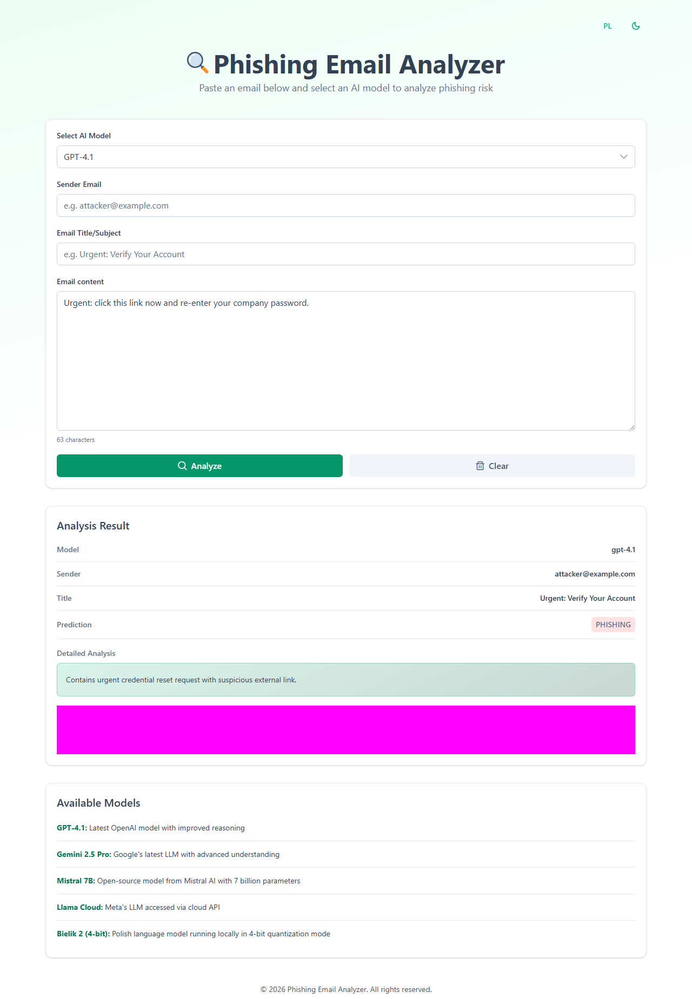
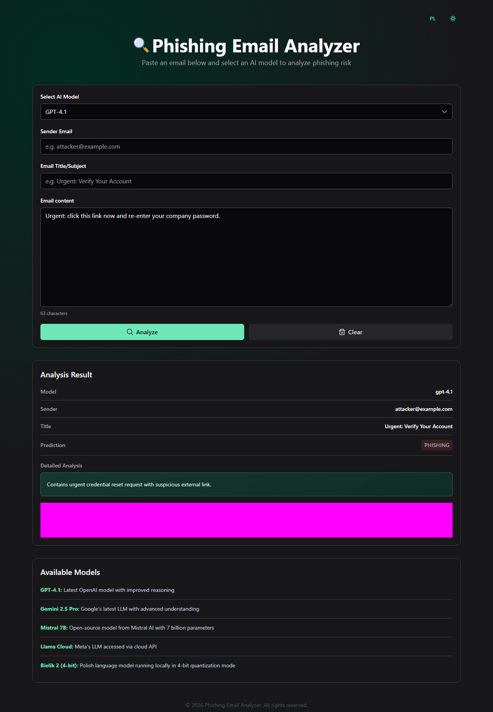
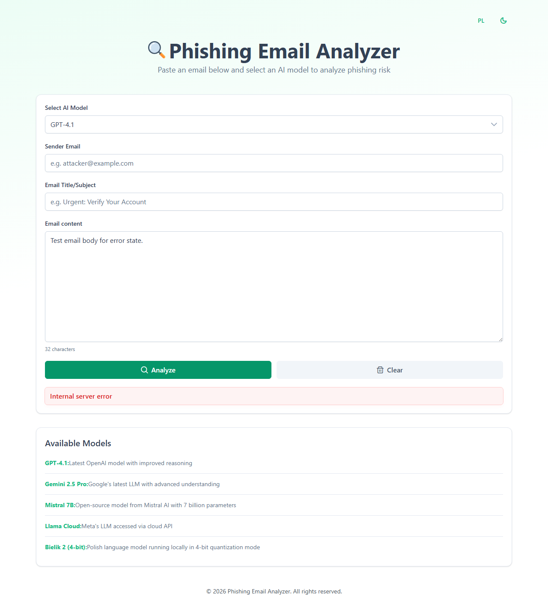
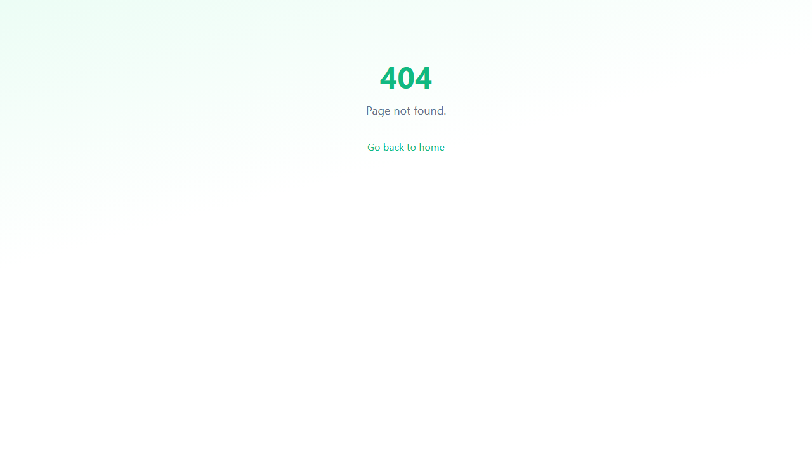
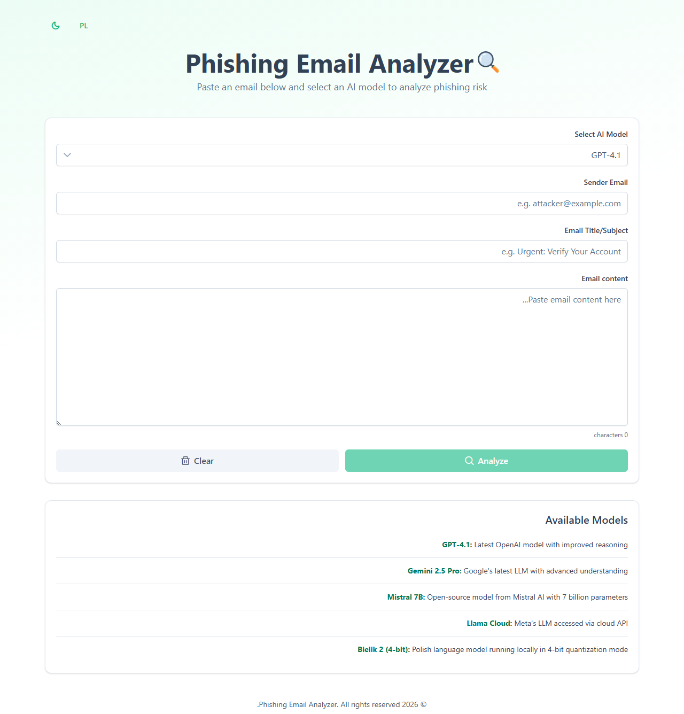
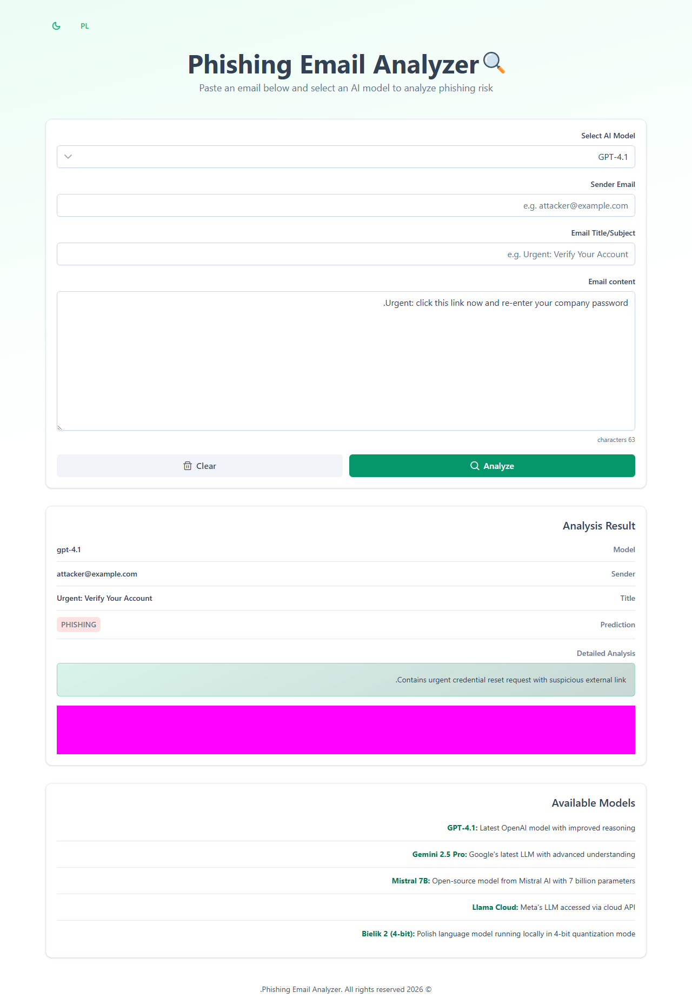
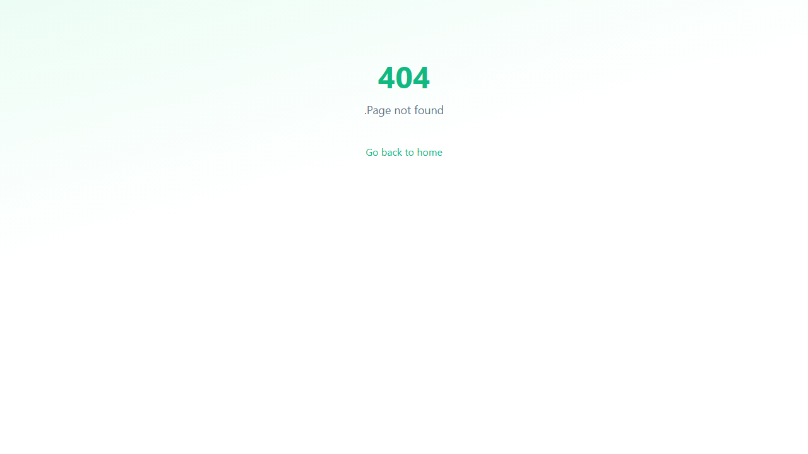

# Phishing Email Analyzer + praca magisterska

Repozytorium zawiera kompletny projekt badawczo-aplikacyjny dotyczący wykrywania phishingu w wiadomościach e-mail. Składa się z:

- aplikacji webowej do analizy wiadomości i porównywania odpowiedzi modeli LLM,
- backendu FastAPI udostępniającego API klasyfikacji,
- danych eksperymentalnych i raportów z uruchomień modeli,
- materiałów do pracy magisterskiej przygotowanych w LaTeX.

Projekt pozwala zarówno uruchomić lokalnie aplikację do analizy pojedynczych wiadomości, jak i wykonywać eksperymenty porównawcze na przygotowanym zbiorze danych.

## Spis treści

- [Phishing Email Analyzer + praca magisterska](#phishing-email-analyzer--praca-magisterska)
  - [Spis treści](#spis-treści)
  - [Opis repozytorium](#opis-repozytorium)
  - [Struktura projektu](#struktura-projektu)
  - [Zrzuty ekranu](#zrzuty-ekranu)
    - [Strona główna – formularz analizy](#strona-główna--formularz-analizy)
    - [Wyniki analizy](#wyniki-analizy)
    - [Strona 404](#strona-404)
    - [Testy RTL (right-to-left)](#testy-rtl-right-to-left)
  - [Wymagania](#wymagania)
  - [Szybki start](#szybki-start)
    - [1. Backend](#1-backend)
    - [2. Frontend](#2-frontend)
  - [Konfiguracja backendu](#konfiguracja-backendu)
  - [Architektura](#architektura)
  - [API](#api)
    - [`GET /`](#get-)
    - [`POST /analyze`](#post-analyze)
  - [Modele](#modele)
  - [Frontend: uruchamianie i jakość](#frontend-uruchamianie-i-jakość)
    - [Uruchamianie i build](#uruchamianie-i-build)
    - [Tłumaczenia](#tłumaczenia)
    - [Testy](#testy)
    - [Jakość kodu](#jakość-kodu)
    - [E2E Playwright](#e2e-playwright)
    - [E2E visual snapshots (Playwright)](#e2e-visual-snapshots-playwright)
  - [Backend: skrypty pomocnicze](#backend-skrypty-pomocnicze)
    - [Porównanie modeli](#porównanie-modeli)
    - [Mieszanie i porządkowanie danych](#mieszanie-i-porządkowanie-danych)
  - [CI i hooki Git](#ci-i-hooki-git)
  - [Dane i raporty](#dane-i-raporty)
    - [Format danych wejściowych](#format-danych-wejściowych)
    - [Raporty](#raporty)
  - [Część pracy magisterskiej](#część-pracy-magisterskiej)
  - [Aktualne ograniczenia](#aktualne-ograniczenia)

## Opis repozytorium

Najważniejszym elementem projektu jest aplikacja Phishing Email Analyzer:

- backend odpowiada za ładowanie modeli i klasyfikację wiadomości,
- frontend udostępnia interfejs użytkownika, routing, testy i internacjonalizację,
- katalog `data/` zawiera dane wejściowe do eksperymentów,
- katalog `reports/` przechowuje wyniki uruchomień modeli,
- katalog `graduate work/` zawiera część pisaną i materiały pomocnicze do pracy.

## Struktura projektu

```text
.
|-- .github/
|   `-- workflows/                    # workflowy CI
|-- .husky/                           # hooki Git
|-- data/
|   `-- data.json                     # zbiór wiadomości do testów
|-- graduate work/                    # LaTeX + materiały do pracy
|   |-- main.tex
|   |-- bibliografia.bib
|   |-- images/
|   `-- presentation/
|-- phishing-email-analyzer/
|   |-- backend/                      # FastAPI, adaptery modeli, skrypty badawcze
|   |   |-- main.py
|   |   |-- test_all_models.py
|   |   |-- shuffle_data.py
|   |   `-- models/
|   `-- frontend/                     # Angular 21, testy, Playwright, linting
|       |-- src/
|       |-- e2e/
|       |-- package.json
|       `-- eslint.config.js
|-- reports/                          # raporty JSON z uruchomień modeli
`-- README.md
```

## Zrzuty ekranu

Poniższe zrzuty ekranu pochodzą z testów wizualnych Playwright (snapshoty przechowywane w `phishing-email-analyzer/frontend/e2e-snapshots/`).

### Strona główna – formularz analizy

| Tryb jasny | Tryb ciemny |
|---|---|
|  |  |
|  | |
|  | |

### Wyniki analizy

| Tryb jasny | Tryb ciemny |
|---|---|
|  |  |
|  | |
|  | |

### Strona 404

| Tryb jasny |
|---|
|  |

### Testy RTL (right-to-left)

| Formularz analizy – tryb jasny | Wyniki – tryb jasny | Strona 404 – tryb jasny |
|---|---|---|
|  |  |  |

## Wymagania

- Python 3.13+
- Node.js 20+
- npm 11+
- opcjonalnie GPU/CUDA dla cięższych modeli lokalnych

## Szybki start

### 1. Backend

```powershell
cd "phishing-email-analyzer/backend"
py -3.13 -m pip install -r requirements.txt
uvicorn main:app --reload --host 127.0.0.1 --port 8000
```

Backend będzie dostępny pod adresem `http://127.0.0.1:8000`.

### 2. Frontend

W drugim terminalu:

```powershell
cd "phishing-email-analyzer/frontend"
npm install
npm start
```

Domyślnie `npm start` uruchamia angielską konfigurację aplikacji na `http://localhost:4200`.

Wersję polską można uruchomić poleceniem:

```powershell
npm run start:pl
```

## Konfiguracja backendu

W katalogu `phishing-email-analyzer/backend` utwórz plik `.env` i dodaj tylko te klucze, które są potrzebne do modeli używanych lokalnie.

```env
OPENAI_API_KEY=...
GOOGLE_API_KEY=...
LLAMA_API_KEY=...
HF_TOKEN=...

# opcjonalnie
MISTRAL_7B_MODEL_ID=mistralai/Mistral-7B-Instruct-v0.3
LLAMA_CLASSIFY_TIMEOUT_SEC=30
LLAMA_CLASSIFY_MAX_RETRIES=0
LLAMA_CLASSIFY_RETRY_SLEEP_SEC=1.5
```

Mapowanie kluczy:

| Zmienna | Model / wykorzystanie |
|---|---|
| `OPENAI_API_KEY` | `gpt-4.1` |
| `GOOGLE_API_KEY` | `gemini-2.5-pro` |
| `LLAMA_API_KEY` | `llama-cloud` |
| `HF_TOKEN` | `mistral-7b` i modele lokalne Hugging Face |

## Architektura

- `phishing-email-analyzer/backend/main.py` dynamicznie ładuje adaptery modeli z katalogu `backend/models/`.
- `phishing-email-analyzer/backend/main.py` udostępnia endpointy `GET /` oraz `POST /analyze`.
- `phishing-email-analyzer/frontend/src/app/` zawiera aplikację Angular 21 opartą o standalone components.
- Routing frontendu obsługuje ścieżki `/`, `/pl` i `/en`.
- Pliki tłumaczeń Angulara znajdują się w `phishing-email-analyzer/frontend/src/locale/`.
- Dane testowe są przechowywane w `data/data.json`, a raporty trafiają do `reports/*.json`.

## API

### `GET /`

Zwraca podstawowe informacje o API, listę poprawnie załadowanych modeli oraz błędy modeli, które nie uruchomiły się podczas startu backendu.

Przykładowa odpowiedź:

```json
{
  "message": "Phishing Detection API",
  "available_models": ["gpt-4.1", "mistral-7b", "llama-cloud", "gemini-2.5-pro"],
  "model_load_errors": {}
}
```

### `POST /analyze`

Przykładowe żądanie:

```json
{
  "email_text": "Treść wiadomości e-mail...",
  "model_name": "gpt-4.1",
  "sender": "Bank <no-reply@bank.pl>",
  "title": "Potwierdź swoje dane"
}
```

Przykładowa odpowiedź:

```json
{
  "model": "gpt-4.1",
  "prediction": "phishing",
  "reason": "...",
  "timestamp": "2026-03-11T22:17:38.123456",
  "response_time_ms": 842.31,
  "sender": "Bank <no-reply@bank.pl>",
  "title": "Potwierdź swoje dane"
}
```

Obsługiwane etykiety klasyfikacji to `phishing` oraz `legit`.

## Modele

| Model ID | Opis |
|---|---|
| `gpt-4.1` | Model OpenAI wykorzystywany jako punkt odniesienia jakościowego. |
| `gemini-2.5-pro` | Model Google używany do klasyfikacji i uzasadnień. |
| `mistral-7b` | Model open-source uruchamiany lokalnie przez `transformers`. |
| `llama-cloud` | Model dostępny przez usługę Llama Cloud. |
| `bielik-2-4bit` | Opcjonalny wariant lokalny, ładowany tylko wtedy, gdy adapter istnieje w repozytorium. |

## Frontend: uruchamianie i jakość

W katalogu `phishing-email-analyzer/frontend` dostępne są najważniejsze komendy:

### Uruchamianie i build

```powershell
npm start
npm run start:pl
npm run build
npm run build:pl
npm run watch
```

### Tłumaczenia

```powershell
npm run extract-i18n
```

Polecenie generuje plik źródłowy tłumaczeń XLF w katalogu `src/locale/`.

### Testy

```powershell
npm test
npm run test:ci
npm run test:coverage
```

### Jakość kodu

```powershell
npm run lint
npm run lint:fix
npm run format
npm run format:check
```

Frontend używa:

- ESLint 9 w flat config (`eslint.config.js`),
- `angular-eslint` dla Angular 21,
- Prettiera do formatowania,
- Playwright do testów E2E,
- Vitest i Angular test runner do testów jednostkowych.

### E2E Playwright

```powershell
npx playwright install
npm run e2e
npm run e2e:ui
npm run e2e:headed
npm run e2e:report
```

### E2E visual snapshots (Playwright)

Testy wizualne korzystają z dwóch konfiguracji:

- domyślna konfiguracja (`playwright.config.ts`) zapisuje snapshoty do `phishing-email-analyzer/frontend/e2e-snapshots/visual/`,
- konfiguracja RTL (`playwright.rtl.config.ts`) zapisuje snapshoty do `phishing-email-analyzer/frontend/e2e-snapshots/RTL/`.

Generowanie / aktualizacja snapshotów (PNG):

```powershell
cd "phishing-email-analyzer/frontend"
npm run e2e:update-snapshots
npm run e2e:update-snapshots-rtl
```

Uruchamianie testów porównujących UI z istniejącymi snapshotami:

```powershell
npm run e2e:visual
npm run e2e:visual-rtl
```

## Backend: skrypty pomocnicze

### Porównanie modeli

```powershell
cd "phishing-email-analyzer/backend"

py -3.13 test_all_models.py
py -3.13 test_all_models.py --models gpt-4.1,gemini-2.5-pro,llama-cloud
py -3.13 test_all_models.py --samples 50 --seed 7
```

### Mieszanie i porządkowanie danych

```powershell
cd "phishing-email-analyzer/backend"

py -3.13 shuffle_data.py
py -3.13 shuffle_data.py --shuffle
py -3.13 shuffle_data.py --renumber
```

## CI i hooki Git

Repozytorium zawiera lokalne i zdalne zabezpieczenia jakości kodu:

- hook `.husky/pre-push` blokuje `git push`, jeśli nie przejdą komendy `build`, `format:check` albo `lint` dla frontendu,
- workflow `.github/workflows/pr-frontend-ci.yml` uruchamia pipeline w kolejności:
  1. `build`
  2. `lint-format`
  3. `check-translations`
  4. `unit-tests`
  5. `e2e-tests`

## Dane i raporty

### Format danych wejściowych

Plik `data/data.json` przechowuje rekordy zawierające co najmniej:

- `id`
- `title`
- `sender`
- `text`
- `ground_truth` (`phishing` lub `legit`)
- `category`

### Raporty

Katalog `reports/` przechowuje raporty JSON z uruchomień modeli, na przykład:

- `gpt_4.1_report_*.json`
- `gemini_2.5-pro_report_*.json`
- `llama_cloud_report_*.json`
- `mistral_report_*.json`
- `bielik2_(4bit)_report_*.json`

## Część pracy magisterskiej

Materiały tekstowe i prezentacyjne znajdują się w katalogu `graduate work/`:

- `main.tex` - główny plik dokumentu,
- `title_page.tex`, `claims_page.tex`, `settings.tex`,
- `bibliografia.bib`,
- `images/`,
- `presentation/`.

## Aktualne ograniczenia

- Adapter `bielik-2-4bit` jest opcjonalny i backend ładuje go tylko wtedy, gdy plik `backend/models/bielik2_4bit.py` faktycznie istnieje.
- Modele lokalne oparte o `transformers` mogą działać wolno bez GPU.
- Backend zwraca błędy ładowania modeli przez pole `model_load_errors`, więc częściowa niedostępność modeli nie blokuje startu całej aplikacji.
- Do pełnego przejścia lokalnych testów E2E potrzebne są zainstalowane przeglądarki Playwright.
